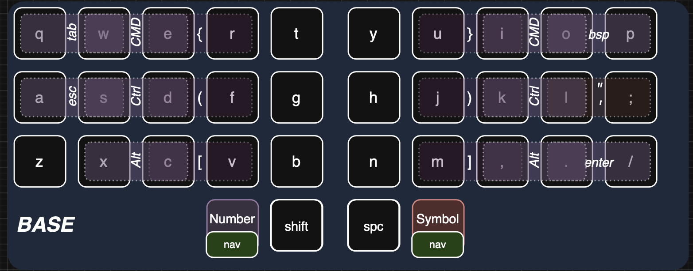
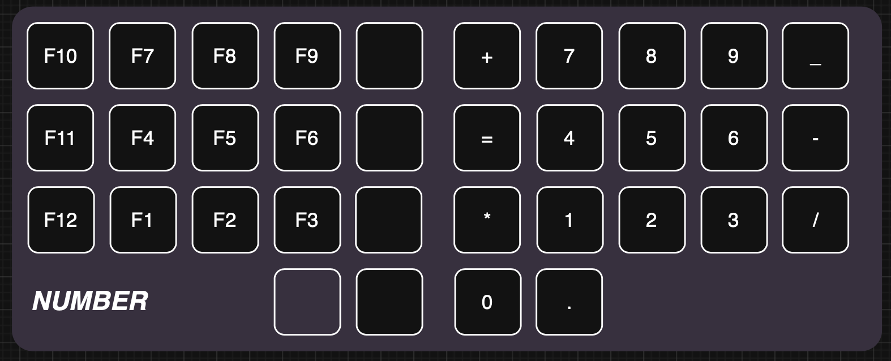
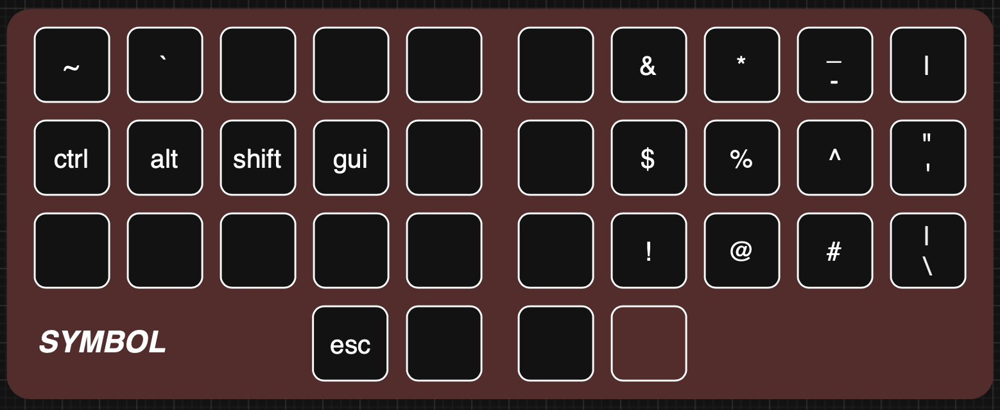
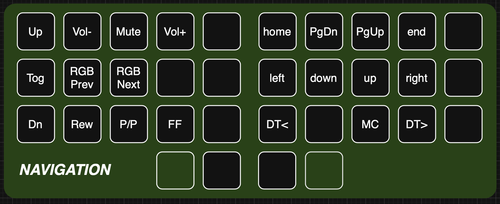

# Pauper's QMK Userspace

Here is where I have my personal QMK configuration stored. I use a 34-key base keymap that I adapt to different layouts (such as Corne, 4x12 ortho, or the Ferris. This is forked from the [QMK Userspace repository](https://github.com/qmk/qmk_userspace).

For information on how to use QMK userspaces, see the [QMK Docs](https://docs.qmk.fm/#/newbs) as a starting point.

---

## The Keymap

The base keymap is QWERTY, with multiple layers for numbers and symbols, etc. I use combos for some of the common non-alpha
keys, like brackets and tab.

### Keymap Layers

The keymap uses 4 layers: a base alpha layer, a numbers layer, a symbols layer, and a navigation layer. Number and Symbol are reached by a single
thumb key each, and navigation is toggled by holding both layer keys.

#### 1. Base Alpha Layer
The base layer is the QWERTY alpha layer, and contians a lot of combos to handle things like brackets, tab, escape, and few other keys. The two outer thumb keys are layer keys, and the two inner ones provide Shift and Space.

#### 2. Number Layer
The number layer puts a number pad under the right hand, along with the math symbols that go with them. I had space left over on the left hand and moved my Function keys there, eliminating the need for a dedicated Function layer.

#### 3. Symbol Layer
The symbol layer roughly corresponds to the shifted number keys. E.g., the same key that is a '2' on the number layer is a '@' symbol on the symbol layer. The other two important additions here are tilde and grave.

#### 4. Navigation Layer
The navigation layer currently holds the arrow keys as they correspond to vim motion keys, analogous home/end and page up/down keys, some desktop and Mac Command Cener controls, media keys, and some RGB backlight keys.

### Adaptations to Layouts

I have adapted my base layout to a few different physical layouts.
- Corne 6 column (outer columns not used)
- 4 X 12 Ortho, such as on the Niu Mini. I have this PCB in my Neuron case, and use my keymap with blank middle columns.
- 2 X 2u 4 row Ortho, such as on the Brick PCB, which was designed by a Really Cool Guy:tm:.
